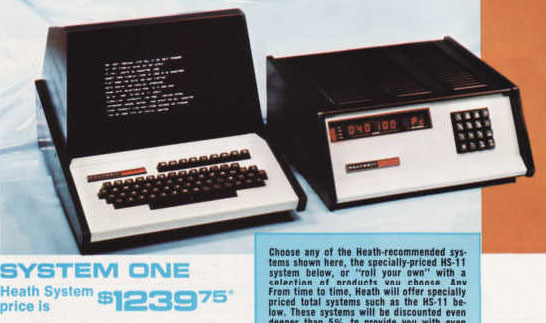

# Where and How Did it all Start? The Influences Which Made Me a "Builder of Things"

It may be appropriate to try and explain visually how my journey to becoming a "builder of all things" started. This page provides a very curt overview of some of the things in my early life which I felt were instrumental to guiding me in the right direction to become the person that I am. In no means is this complete but as it gleams over some of the more significant aspects of my life, including my lifetime of work in software development. Please note that almost all items you may see were actually purchased and paid by myself, even at a very young age, as I never got any free ride or handouts. 

## A Visual Timeline to Some of the Main Influences in my Early Life

I've always attributed my inquisitive interest in the sciences and engineering to this sole book which I can recall flipping through around age 5 or 6. As its cover states, it is "profusely illustrated with over 2500 pictures" from 1965. It is a truly wonderful book for the young mind. While other kids had books of animals, I had books about how things worked. 

     

     

Indirectly, I'll also make reference to the "The Encyclopedia of Space" by Paul Hamlyn around that same period of my life. It didn't have a lot of impact on me but I do associate it with experiencing the Apollo moon program in the 1960s and early 70s. I was and continue to be a big fan of the Apollo program. 

Relating to that last comment, I've had an armchair interest in astronomy since early childhood because I helped my father photograph the Dunlap Observatory in the late 1960s and also to meet a lot of interesting people at the University of Toronto while he did his official UofT photo shoots. This influenced me such that I indirectly got involved with astronomy viewing nights in the 2000s and 2010s.

Between ages ~5 and ~10 I came into possession of stacks of 1950's and 1960's Popular Electronics, Popular Mechanics and Mechanics Illustrated magazines. These were *so very different* compared to the lesser magazines of latter decades. They were super hand's on with tons of DIY gadgets and things to build every month, with clear and concise explanations. This is when I could "feel" the need to build things but wasn't quite old enough to build a "garage addition" in the back-yard. Nevertheless, I had caught the bug and started to (try) and build things from these magazines. Naturally, they also painted a picture of a futuristic world where space travel and supersonic travel were possible.

     

This page would not be complete if I did not make a mention of Mecanno. What I recall is that of going to a department store at Christmas time, for a few years, to look at all of the lovely new Mecanno kits. They came in numbered versions, with each higher number being more complex and being more expensive. I believe we eventually came to have 2 or 3 of the mid-priced kits. This was a popular toy for boys in the 1970s. If I had become a mechanical engineer then I'd say how much this building kit influenced me but rather it just became an early outlet to teach me how to follow instructions and turn them into something real and solid. It also taught me the value of money, as we just couldn't afford anything that was being marketed towards us. 

      

Around age 11 I was seeking "something interesting and challenging" to build but for which I was actually capable of building. I was really starting to ramp up on my "project building" at that age. Being an avid reader of Scientific American I had it in my mind that I'd build the Nitirogen laser from the June 1974 issue. How hard could it be? This was influenced directly by the gas laser at the Ontario Science Centre which I first saw in 1970-1972 (which had been built by GE France for the 1967 Expo '67 in Montreal). As you can see, it did get built but I never got it to function since I didn't have access to a bottle of Nitrogen, pull a good vacuum or get a high voltage spike working. But it did influence me to build confidence in making a complex project from plans. 

For the record, my foray into construction, woodworking and fine cabinetry design (from an early age) was influenced by my father, his relatives and ancestors. Going back a hundred years, my grandfathers were all cabinetry people or carpenters. I just inherited their genes and was basically "born with a hammer in my hands". It took only 6 years to go from building simple bookends to a fine hutch and cabinet. When you are young you can learn fast. That probably would have become my vocation if I were born decades earlier.

Around that same time, from age 8 to 12, I got heavily into R/C airplane building which is shown in [this album](/RC Airplanes). I think this was, naturally, my first outlet to become a "builder of things". I recall enjoying the learning of building bigger and better planes as my talent and experience grew. I'm not sure of its original influence but I'd surmise that I got some balsa wood model kit(s) as gifts and then just learned from there onwards. My initial builds were pretty bad but I was approaching a professional builder by age 12 but then computers entered my life and my direction in life changed...

I should ideally not mention this history as it was from a different and failed timeline, something that "could have been". For the first 12 years of my life I was "born into photography" and had a camera in my hand since I was 3. I would ogle over the 8mm and 16mm cameras in the counter display at Sears each weekend when I was 8 and 9 years old. At age 10, after working out a financing pay-back deal with my parents, I got a Eumig 8mm movie camera (no sound). That influenced me to make a series of "productions" in the basement, including a Red Barron influenced 30sec commercial for a breakfast cereal and several stop motion films. In another timeline I could easily have become a movie or television producer. However, it did have a #1 major impact on my life as it set in motion how I took to debt and credit, given the number of years it took me to pay it back to my parents. It made me realize how much effort it would take to pay down a debt if and when I may have had one. 

In early 1975 I will always recall seeing the January 1975 issue of "Popular Electronics" on a table at our local library with the Altair 8800 computer on its front cover. I was immediately mesmerized by it. Alas, I was too young and without money to buy such an expensive kit. 

However, given my $5 weekly allowance, by 1976 and 1977 I would go out once per month and buy a slew of R/C Airplane, woodworking, electronics and Popular Mechanics magazines. I was just and only then "getting into the swing" of being a "builder of everything" and actually able to build whatever I had in mind. These magazines fueled my boundless enthusiasm to see what others have built and try to copy them. 

It was at this time that I started to rebuild portions of my parents house (as trained by my ancestry of family carpenters since childhood), R/C airplanes, my word-working items and some of my early electronics projects which are documented in pictures elsewhere. 

While I didn't feel it had a major impact on my life, I believe many kids of my age had one of these Radio Shack "150 Electronic Project Kit". It was interesting but my brain was already at a level of wanting to build a computer and not simple circuits. 

This review would not be complete nor accurate if I did not mention the huge impact that Radio Shack had on me. For my 10th birthday I asked that I spend the day at the local Radio Shack store so that the owner could help make my clock kit work (which it never did). I don't know what I and others would have done without Radio Shack. It was like Shangri-La to me and many others. 

Radio Shack influenced me in so many ways, some of which were:

- I bought most of my electronics "kit" and parts from Radio Shack

- It was where I really got to use a home computer in a hand's on manner for the first time (TRS-80 Model I), before I got my own Exidy Sorcerer. 

- The yearly catalogues were where I could ogle over the huge stereo/quad speakers and receivers. This lead to my early life of wanting to acquire a high quality stereo system and of building my own 12" [ducted speakers](/Woodorking/1983_06 - Speaker pair with 12in woofers.jpg).

Even today I miss not being able to quickly visit a Radio Shack store and buy some electronic components:

And I absolutely must mention how Radio Shack heavily influenced me around age 8 and 9 when I temporarily got into "big TV antenna setups". The catalogue made me envy our neighbours who had large antenna masts and "long range" antennas but they were rather expensive (3x more in today's dollars). Given my new "builder's mentality" I went and fished coax cable throughout the house in anticipation of putting up one of these large Radio Shack antenna. However, that's when cable TV arrived in our neighbourhood. I'll always recall how stunned the cable TV guy was when he came in to wire up the house and found out I had done it myself. 

In the late 1970s I was finally getting old enough to "slide and migrate into PC computing" just as the PC home computing market was starting. Around 1977 and 1978 I started to become influenced by the Heath product catalogue and all of its fascinating kits but with costs out of my range. I was enamoured by their Ham radio setups (and from "CQ" and "73" magazines) as well as their new Heath H8 home computer. Because of that Heath influence I recall, one evening, going to a local electronics college and trying to enroll in their night school educational program only to be told (politely) that I was far too young. 

        

I was actually on the cusp of studying for my Ham radio license and getting into a traditional life of "being a Ham radio operator" when, at that same time, the TRS-80 Model I, PET, Apple II, IMSAI 8080 and Heath H8 (among other) computers came to market. I also got to play with a KIM-1 computer which I can say was the very first computer I toggled in a bootstrap routine by switches. I was hooked and my life would not be the same afterwards. I've long stated to myself that "If I was born 2 to 3 years earlier then I would have started a life into being a Ham radio operator and starting with a Imsai 8800 computer". 

I could not afford one of these consumers machines (as they were in the $1000 to $2000 range, in late 1970s dollars) so for a full year I'd go to our local shopping mall to play with the TRS-80 and PET machines, or venture downtown to visit the local Apple + Exidy Sorcerer + IMSAI 8080 stores. I would eventually make enough money to buy a Exidy Sorcerer I with a whopping 4K of memory. All I can say is that this was a really exciting, fascinating and enthralling time when things were changing every week and month. BYTE magazine became my monthly portal into this rapidly expanding universe (with some 1982 issues coming in over 543 pages!). Having the Sorcerer computer hugely impacted my life and influenced me to become a professional software/hardware developer. 

I will not try to enumerate that computing phase of my life as it would take an entire book. Rather, it is exemplified by [the pictures elsewhere in my collections](/Hardware).

Since age 5, when I got a Magnus organ for Christmas, I've been interested, to some varying degrees, with music. This is an uneasy and oddly defined statement for me to make since I have little creative musical talent (being a logical engineer) but at the same time devoting a fair bit of my mental focus and life to music synthesis machine design. If I never got involved with computers or electronics then I may have easily become a record producer or sound engineer for sure. I have never been able to explain where I got the drive and focus but from the late 1970s onwards and right up to the 1990s I spent a lot of my time working towards "digital music synthesis" as a passion and  core fixation. The very first thing I ever did with my newly purchased Exidy Sorcerer was play "Daisy Bell" (as heard in 2001: A Space Odyssey") though an AM radio and noise emitted by the CPU. I would spend the next 10 years fixated with designing and building digital music synthesis machines and computers. 

However, since this page focusses on "What influenced me", I do have to draw attention to BYTE magazine and Steve Ciarcias's monthly articles. I vied for BYTE to arrive each month to see what new hardware device Steve had made. In retrospect I didn't build many of his devices but his articles did provide the fuel and enthusiasm for me to build everything else of that same era. 

This page would not be complete if I did not mention "Basic Computer Games" edited by David Ahl. Young people today will just not be able to relate to this explanation whatsoever. When these initial home computers came out in the late 1970's there was literally no software for them and any that existed were sold on cassette at a fair 
cost. Most people would buy magazines and hand type in the several page machine language opcode or BASIC listings. I recall spending several summer vacations hand typing in most of the games in these two books. Why would anyone be so insane to do so? Because there just wasn't any other options at the time. Also, many games (in these books and magazines) would often come with illustrations to make you believe that you'd be running a real VR simulation in 3D with amazing 3D graphics only to find that the resulting game was two [] brackets moving in the middle of the screen (-: You have to keep in mind that these machines were so slow that  refreshing a page of simple text on the 40x24 character screen would take a second or two. Nonetheless, at that time, we were all enthralled to even be doing such "advanced computing" in our own homes. As noted above, the computing world was changing by the minute and hence there was always something new to look forward to every few weeks - we've lost all of that in our modern staid times.

For historical reference, I'll also make mention to my fascination of "trying to turn my Exidy Sorcerer Z80 machine into a Radio Shack TRS-80 Model II". I was one of the  few people on the planet who ended up achieving that lofty goal over a few years of work. You see, the TRS-80 was a vastly more popular machine and hence had mega-tons of interesting software for it. The Sorcerer had poorer marketing and hence a limited audience, so not much good software. Being a computer hardware/software hacker, I reverse engineered the TRS-80 Level II basic and operating system. I then ported and mapped over the TRS-80 machine language runtime software to the Exidy Sorcerer. I also designed some hardware circuits to map any references that the TRS-80 software would do to its video memory to the Sorcerer video memory. With these changes, I was able to have the Exidy Sorcerer run TRS-80 machine language games and Level II BASIC files. I consider that one of my greater of achievements of the early 1980s given how near-impossible the goal was. 

For good measure, I'll also mention this "S100 Bus Handbook" for some additional historical perspective. From ~1975 most desktop computers (like the IMSAI 8080, etc) were based on the S-100 bus and the CP/M operating system (both of which my expanded Exidy Sorcerer eventually came to have). A machine would be composed of a CPU card, memory card(s), I/O card and disk controller card; all of which were vastly expensive and mostly geared towards business users. This was a time when the IBM PC was yet to be introduced. This book had some influence on me as I had used it to learn how to design and build my own S-100 I/O card as seen in this photo.

